# Course 5: Art and Science of Machine Learning

**_Course Link_**: [Art and Science of Machine Learning](https://www.coursera.org/learn/art-science-ml)

## Achievement goal:

    

## Solution

### Week 1

- Quiz 1:
    

        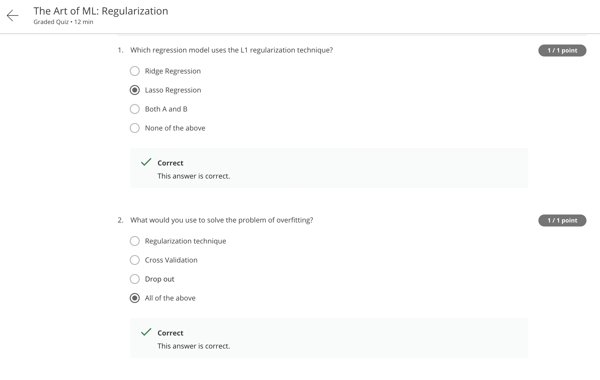
    

    

        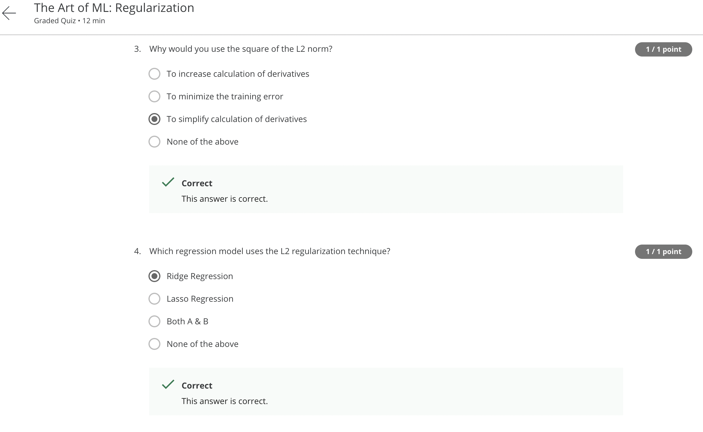
    

    

        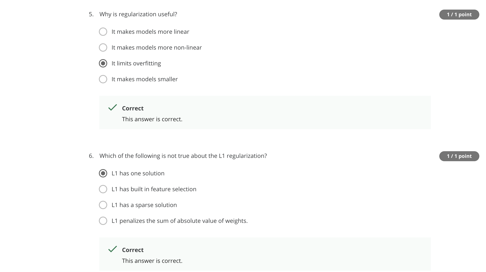
    

### Week 2

- Quiz 1:
    

        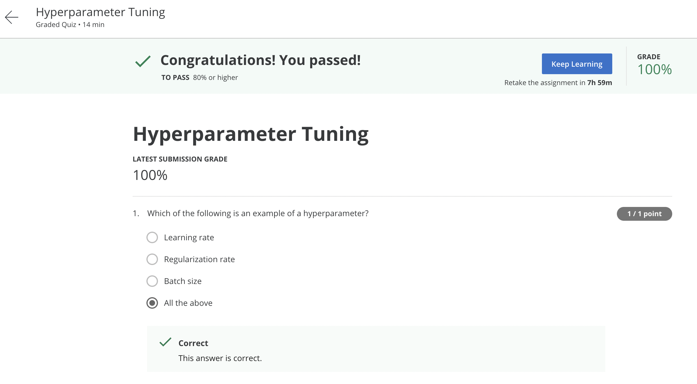
    

    

        
    

    

        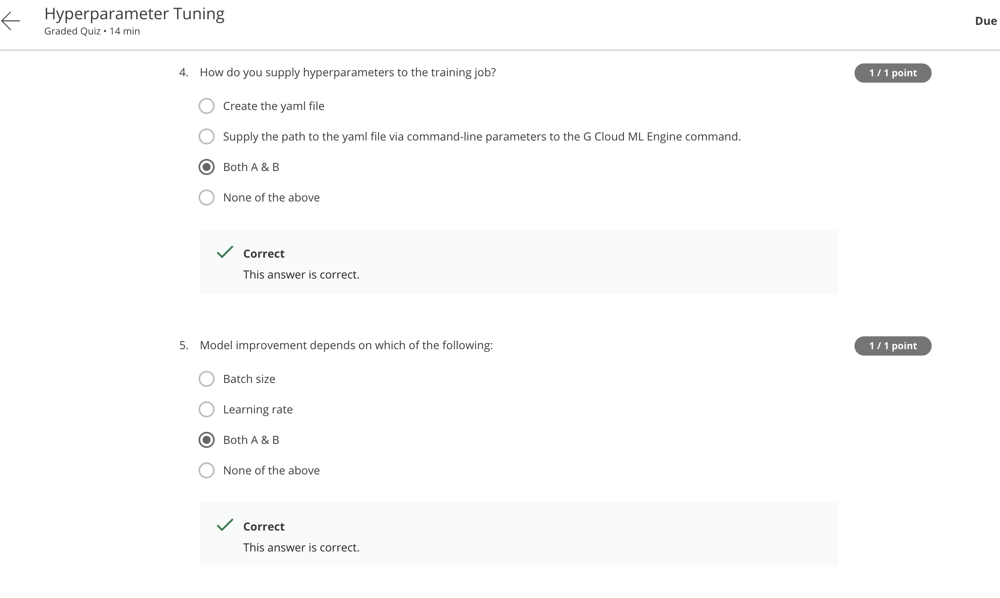
    

    

        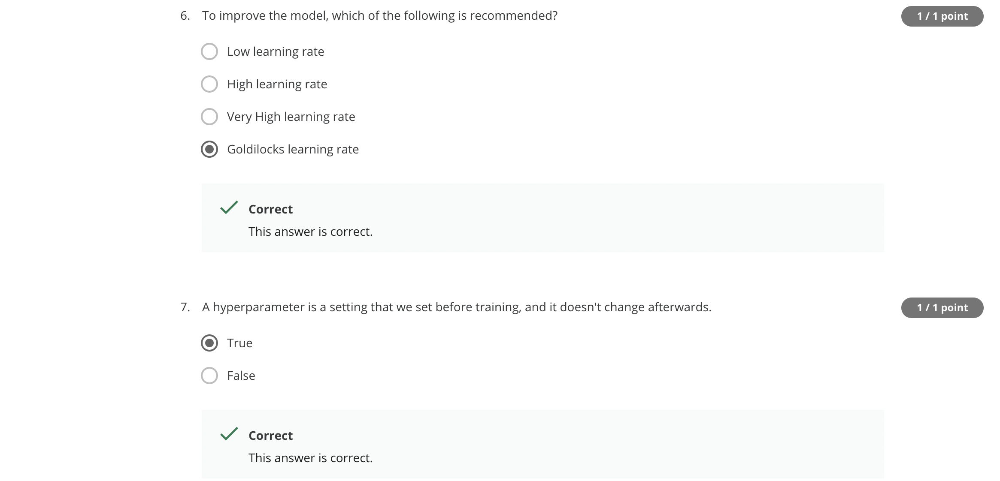
    

- Quiz 2:
    

        
    

    

        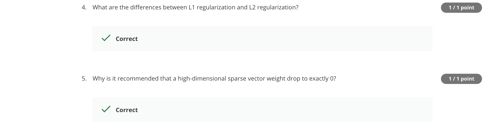
    

- Quiz 3:
    

        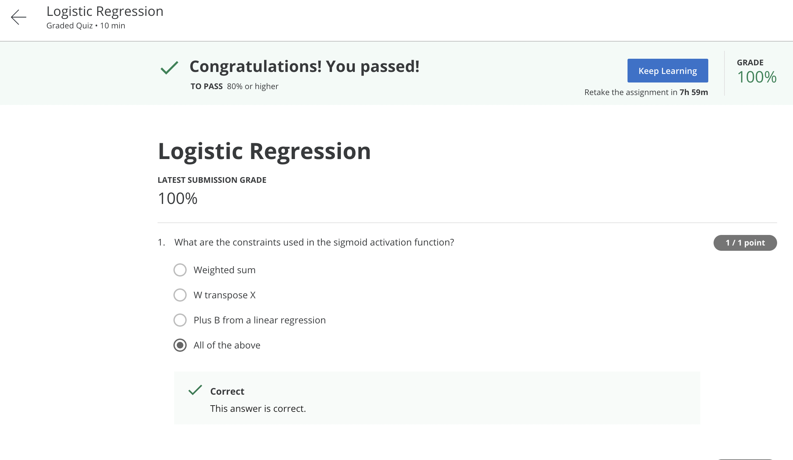
    

    

        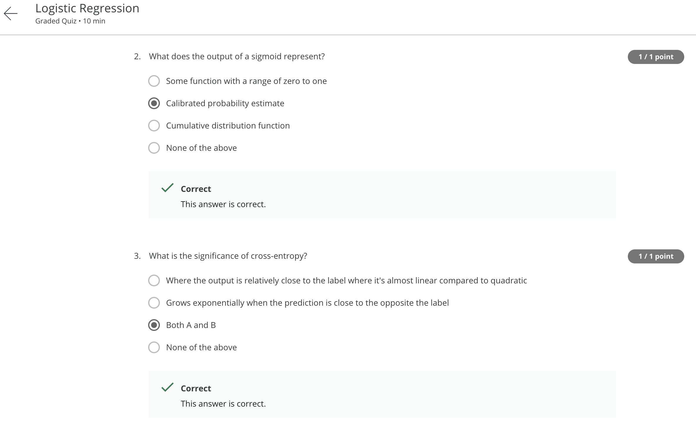
    

    

        
    

### Week 3

- Quiz 1:
    

        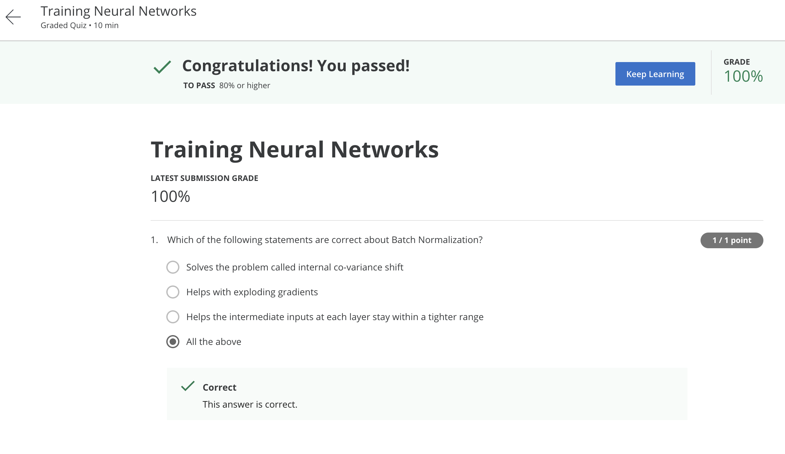
    

    

        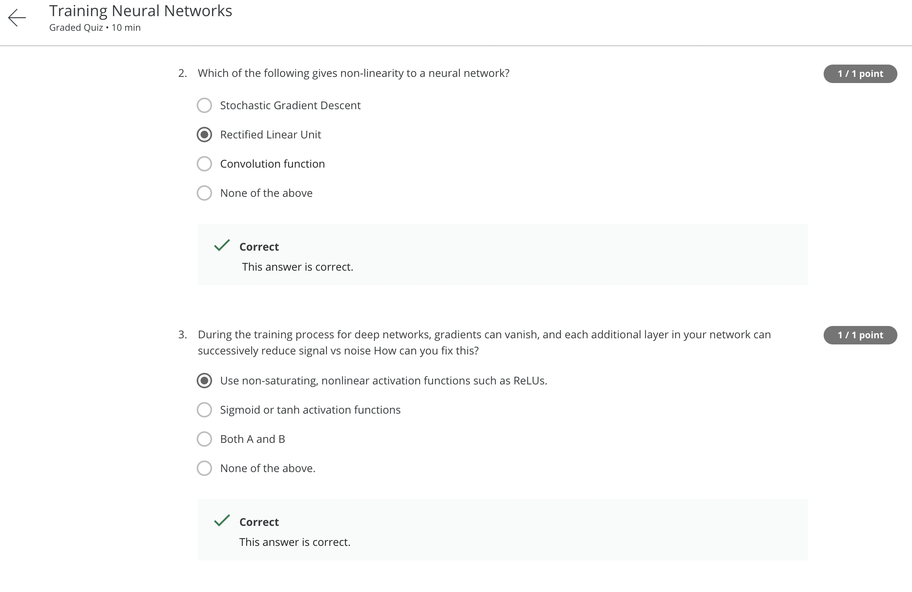
    

    

        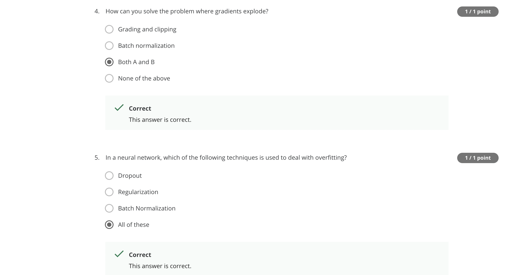
    

- Quiz 2:
    

        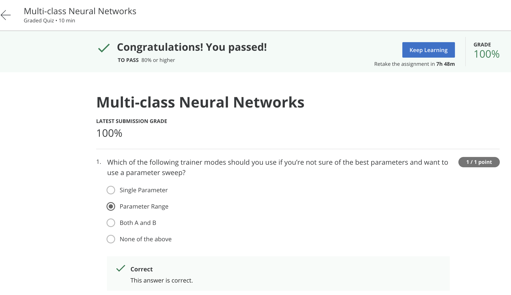
    

    

        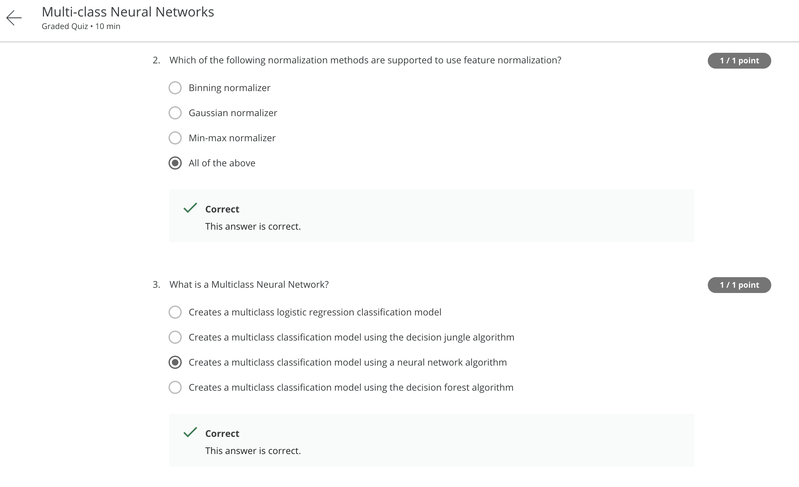
    

    

        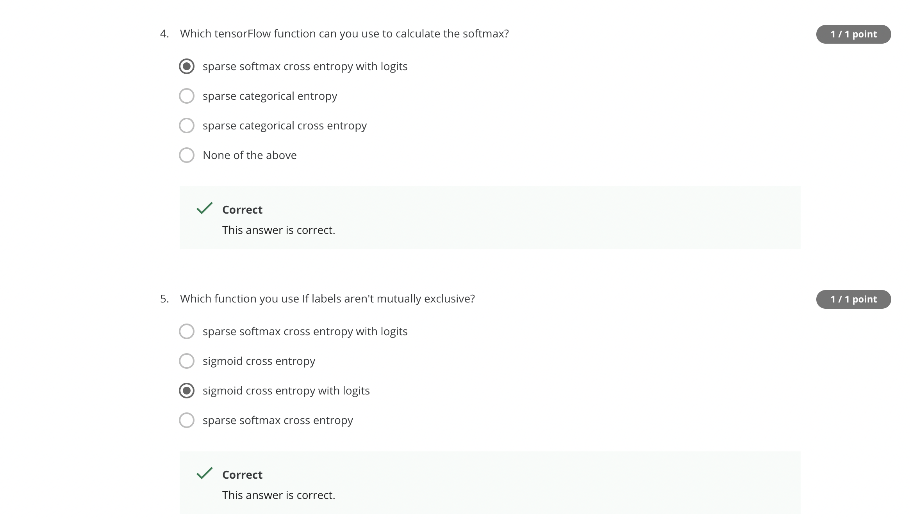
    

- Quiz 3:
    

        
    

    

        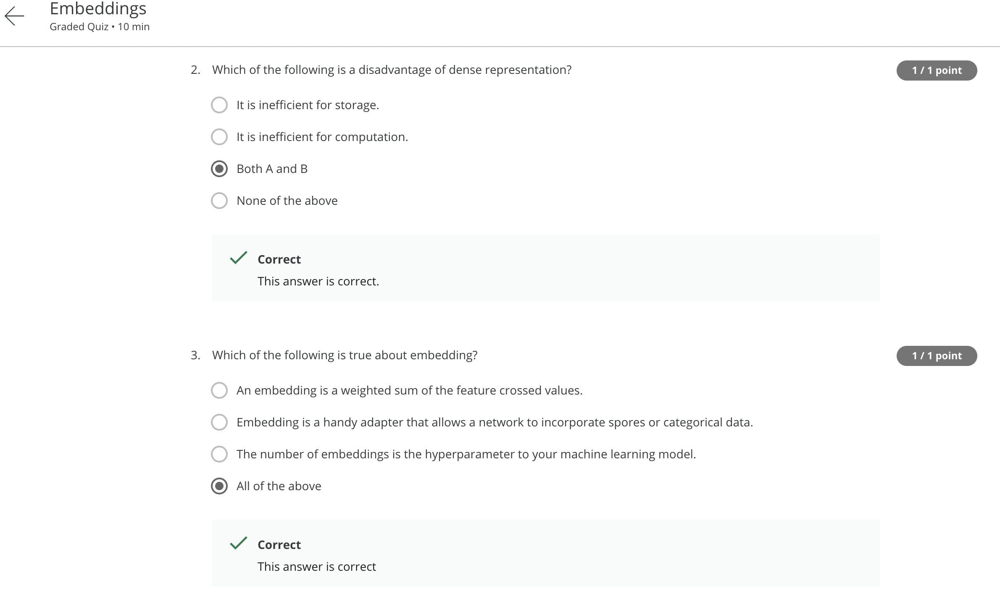
    

    

        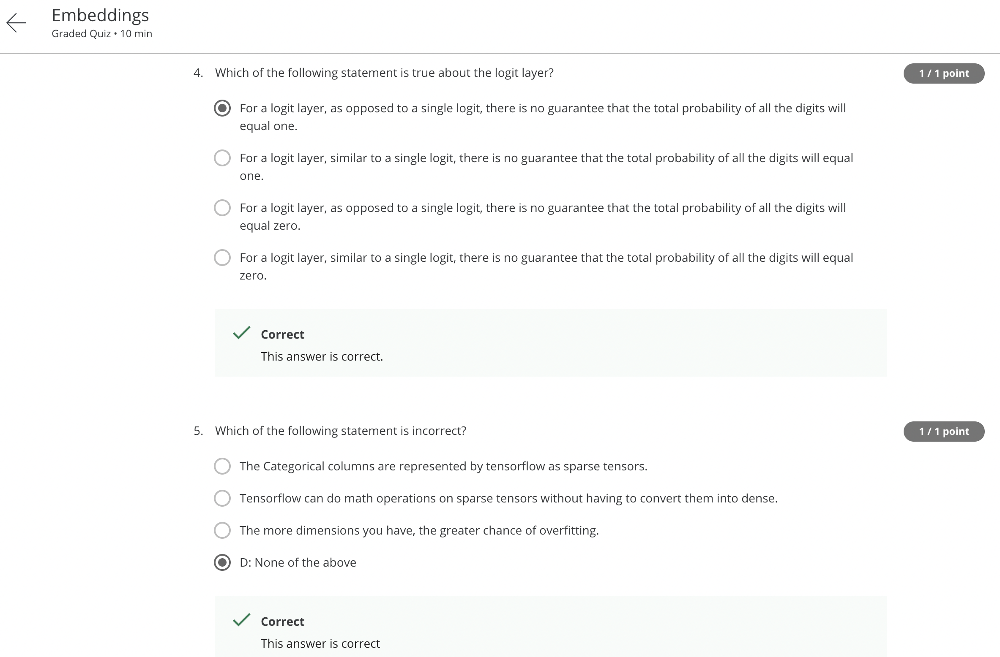
    

## Contributors:

- 🐮 [@honghanhh](https://github.com/honghanhh)
- 🐔 [@tiena2cva](https://github.com/tiena2cva)
