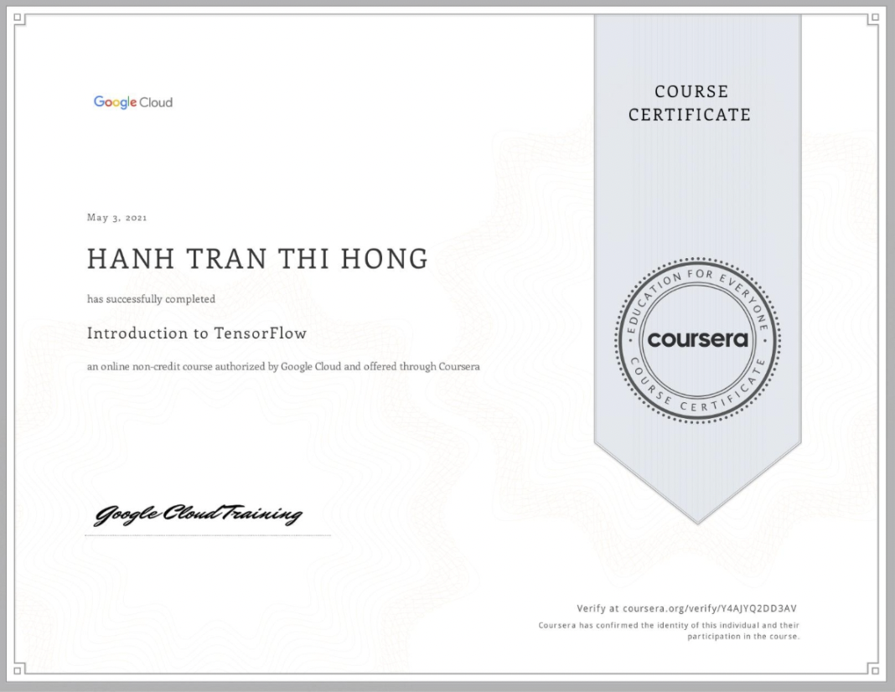
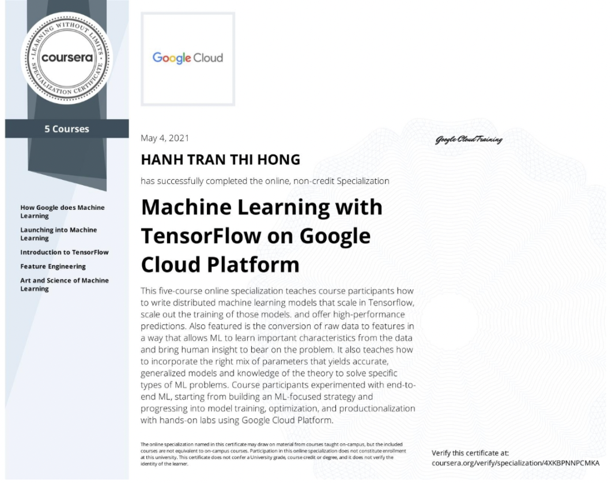

# Machine Learning with TensorFlow on Google Cloud Platform

Course Link: [Machine Learning with TensorFlow on Google Cloud Platform](https://www.coursera.org/specializations/machine-learning-tensorflow-gcp)

This reporatory contains the solutions of every questions/quizes/exercises to achieve the badge as well as a short summary for each course, including

## Course

### 1. How Google does Machine Learning

- [Course](https://www.coursera.org/learn/google-machine-learning)
- [Solution](https://github.com/GafBof/ml_with_tf_on_gcp_specialization/blob/master/Course%201/README.md)

    

### 2. Launching into Machine Learning

- [Course](https://www.coursera.org/learn/launching-machine-learning)
- [Solution](https://github.com/GafBof/ml_with_tf_on_gcp_specialization/blob/master/Course%202/README.md)

    

### 3. Introduction to TensorFlow

- [Course](https://www.coursera.org/learn/intro-tensorflow)
- [Solution](https://github.com/GafBof/ml_with_tf_on_gcp_specialization/blob/master/Course%203/README.md)

    

### 4. Feature Engineering

- [Course](https://www.coursera.org/learn/feature-engineering)
- [Solution](https://github.com/GafBof/ml_with_tf_on_gcp_specialization/blob/master/Course%204/README.md)

    

### 5. Art and Science of Machine Learning

- [Course](https://www.coursera.org/learn/art-science-ml)
- [Solution](https://github.com/GafBof/ml_with_tf_on_gcp_specialization/tree/master/Course%205)

    

## Achievement goal:

    

## Contributors:

- 🐮 [@honghanhh](https://github.com/honghanhh)
- 🐔 [@tiena2cva](https://github.com/tiena2cva)
